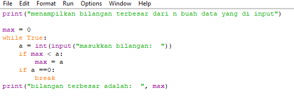
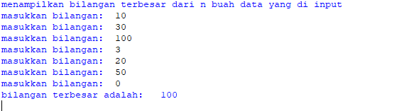

 # Uts Susulan
# Buat program untuk menampilkan bilangan terbesar dari n buah data yang diinputkan

- penjelasan alur program
print("Menampilkan bilangan terbesar dari n buah data yang diinput") - adalah perintah untuk menampilkan judul program

max = 0 - adalah perintah untuk menampilkan nilai max yang adalah 0

while True: - adalah perintah untuk pengulangan hingga waktu yang tidak ditentukan

a = int(input("Masukkan Bilangan: ")) - adalah perintah untuk menginput nilai integer

if max < a: - adalah perintah untuk tipe data if atau jika, maksimal nilai lebih kecil dari a atau integer

max = a - perintah untuk nilai maximal sama dengan a atau integer

if a ==0: - perintah untuk tipe data if atau jika a sama dengan 0 maka

break - perintah untuk mengakhiri pengulangan, jadi jika menginput nilai 0 maka pengulangan berakhir atau selesai

print("Bilangan Terbesar Adalah: ", max) - adalah perintah untuk menampilkan hasil bilangan yang terbesar dari angka-angka yang telah terinput

- berikut gambaran programnya

- berikut hasil program saat dijalankan
